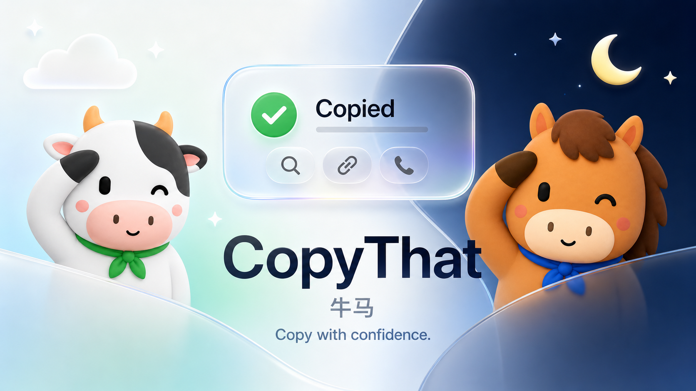

# CopyThat（牛马）2.1.0

**CopyThat** is a lightweight native macOS copy-feedback assistant. 
**牛马**是一款轻量的 macOS 原生复制反馈助手。

[简体中文](#简体中文) · [English](#english)

---

## 简体中文

### 为什么做 CopyThat？

这个项目最初源于一个很简单的烦恼：在 Mac 上按下 `Command + C`
之后，偶尔会遇到复制没有生效的情况。

系统没有明显反馈，所以在粘贴之前，很难确定内容到底有没有复制成功。
CopyThat 最初只想解决这一件事：当系统剪贴板成功更新时，立即显示一个轻量浮窗，
让我一眼确认刚才的内容确实复制成功了。

继续开发后，我发现复制之后通常还有下一步操作。于是 CopyThat 从单纯的
“复制成功提醒”，逐渐变成了一个轻量的复制助手：确认复制成功，并根据复制内容
提供刚刚好的下一步操作。

### 可以做什么？

- **复制反馈**：剪贴板更新后立即显示不抢焦点的 Liquid Glass 浮窗。
- **链接**：识别 `http://`、`https://` 和 `www.` 开头的地址，点击即可使用 Safari 打开。
- **文字**：点击 **Search**，使用 DuckDuckGo、Bing、百度、Google 或自定义搜索引擎搜索。
- **数学表达式**：本地计算 `12 * (3 + 4)`、乘除、余数和乘方，点击 **Copy Result** 复制结果。
- **英文单词**：自动展开英文词典释义；系统中英语言包已安装时自动补充中文词义，未安装时由用户点击下载。
- **单个汉字**：直接在浮窗显示拼音和系统词典释义，**Details** 可打开更大的阅读窗口。
- **电话号码**：点击 **Call**，交给 macOS 的 `tel:` 处理程序拨打。
- **邮箱地址**：点击 **Compose**，打开默认邮件 App 并自动填入收件人。
- **Finder 文件**：点击 **Show in Finder**，直接显示文件所在位置。
- **图片**：显示临时低分辨率缩略图，浮窗关闭后立即释放。
- **代码**：本地识别 Python、JavaScript、Swift、HTML、CSS、JSON、SQL 和 Bash。
- **格式化**：JSON 和 Python 可在用户主动点击 **Format** 后预览并复制格式化结果。
- **插件开关**：内容识别和操作按钮都是独立插件，可在设置中分别启用或关闭。
- **中英文界面**：默认跟随 macOS 系统语言，也可在设置中固定为简体中文或 English，立即生效。
- **插件安装管理**：内置内容插件和操作插件均可暂停、删除及重新安装；删除是可逆的，不下载或加载外部代码。

### 2.1 多语言与插件管理

2.1 增加“跟随系统 / 简体中文 / English”界面语言选项。跟随系统模式会读取
macOS 首选语言，中文系统自动显示中文，其他语言环境使用英文。选择会保存在本地。

插件设置分为“已安装内容插件”“已安装操作插件”和“可安装插件”。删除插件后，
它不会再参与这次剪贴板分析，也不会生成操作按钮；重新安装会立即恢复并默认启用。
这些都是 App 内置、经过编译的轻量模块，不会从网络下载代码，也不会扫描插件目录。

### 2.0 插件架构

2.0 将内容识别和按钮动作从 HUD 中完全拆开。`ClipboardContentDetector`
只负责识别一次复制内容；`ClipboardActionPlugin` 只负责为已识别内容提供一个用户主动点击的动作。
主程序只遍历注册表，因此以后增加新的识别或操作时，不需要重写浮窗和主流程。

这些是编译进 App 的轻量本地插件，不是独立进程，也不会在空闲时执行。

### 它不是什么？

CopyThat **不是剪贴板历史管理器**：

- 不保存复制历史
- 不建立剪贴板数据库
- 不上传剪贴板内容
- 不记录剪贴板原文
- 不包含统计、遥测或自动更新服务

所有内容识别均在 Mac 本地完成。中英翻译由 macOS 系统语言模型处理；如果尚未安装语言包，
浮窗会显示 **下载** 按钮，只有用户点击后 macOS 才会显示安装界面。语言包不会打包进 CopyThat。只有当你主动点击 **Search**、**Open Safari**、
**Call** 或其他外部操作时，对应内容才会交给系统 App 或你选择的搜索引擎。

### 下载与安装

1. 从 [最新 Release](https://github.com/evanlng/CopyThat/releases/latest) 下载 `CopyThat.dmg`。
2. 打开 DMG，将 `CopyThat.app` 拖入“应用程序”文件夹。
3. 从“应用程序”启动 CopyThat；它只显示在菜单栏，不会出现在 Dock。

当前安装包使用临时签名，尚未经过 Apple 公证。首次启动时，macOS 可能要求你按住
Control 点击应用并选择“打开”。免除此步骤需要 Apple Developer Program、
Developer ID 签名和 Apple 公证。

### 系统要求

- macOS 14 或更高版本
- Apple Silicon Mac（arm64）
- 从源码构建需要 Xcode 27 beta 或更高版本
- 无第三方依赖

### 从源码运行

1. 使用 Xcode 打开 `ClipboardFeedback.xcodeproj`。
2. 选择 `ClipboardFeedback` scheme 和 **My Mac**。
3. 点击 Run。

最终产品名称是 `CopyThat.app`；简体中文系统中显示为“牛马”。

### 性能与隐私设计

- `ClipboardMonitor` 只检查 `NSPasteboard.changeCount`，正常间隔为 250 ms；
  复制后短时间切换为 80 ms，并在 2.4 秒后恢复。
- Timer tolerance 允许 macOS 合并唤醒；暂停反馈时计时器会完全停止。
- 只有剪贴板变化后才进行一次有界分析，不持续处理内容。
- 插件只在这次分析中按固定顺序快速判断；词典只对一个短单词或单个汉字按需查询。
- 文本只短暂保留最多 1,000 个字符；文件最多读取 20 个 URL。
- 图片仅生成最大 240 px 的临时缩略图，不写入磁盘或缓存。
- 快速连续复制会复用同一个浮窗和 SwiftUI hosting view。
- 2.1 Apple Silicon Release 连续三次空闲采样均为 0.0% CPU，常驻内存约 18 MB、3 个线程。

### 已知限制

当前版本确认的是“系统剪贴板已经发生变化”。它不会全局监听 `Command + C`，
因此无法直接弹出“复制失败”提示。未来若加入该功能，需要单独的键盘事件监听，
并由用户授予输入监控或辅助功能权限。

---

## English

### Why CopyThat?

CopyThat started with a small but recurring frustration: after pressing
`Command + C` on a Mac, a copy action would occasionally appear to do nothing.

macOS provides no obvious confirmation, so it is difficult to know whether the
clipboard was actually updated until you try to paste. The original goal of
CopyThat was simple: show a lightweight floating HUD whenever a clipboard update
succeeds, making successful copies immediately visible.

While building it, I realized that copying is often only the first step.
CopyThat therefore evolved from a copy-confirmation indicator into a lightweight
assistant that recognizes the copied content and offers the most useful next action.

### What can it do?

- **Copy feedback**: shows a non-activating Liquid Glass HUD after a clipboard update.
- **Links**: recognizes `http://`, `https://`, and `www.` addresses and opens them in Safari.
- **Text**: searches with DuckDuckGo, Bing, Baidu, Google, or a custom search engine.
- **Math expressions**: locally evaluates bounded expressions such as `12 * (3 + 4)` and offers **Copy Result**.
- **English words**: automatically expands the local English definition and adds a Chinese meaning when Apple's on-device language pack is installed; otherwise the HUD offers an explicit download button.
- **Single Chinese characters**: shows pinyin and the local dictionary definition directly in the HUD, with a larger optional details window.
- **Phone numbers**: hands the number to the macOS `tel:` handler through **Call**.
- **Email addresses**: opens the default mail app with the recipient filled in through **Compose**.
- **Finder files**: reveals copied files through **Show in Finder**.
- **Images**: displays a temporary low-resolution thumbnail and releases it with the HUD.
- **Code**: locally detects Python, JavaScript, Swift, HTML, CSS, JSON, SQL, and Bash.
- **Formatting**: JSON and Python can be reviewed and copied after the user clicks **Format**.
- **Plugin controls**: content detectors and action buttons can be enabled independently.
- **English and Chinese UI**: follows the macOS language by default, or can be fixed to Simplified Chinese or English with immediate updates.
- **Plugin installation controls**: built-in content and action plugins can be paused, removed, and reinstalled. Removal is reversible and never downloads or loads external code.

### 2.1 localization and plugin management

CopyThat 2.1 adds System, Simplified Chinese, and English interface language
options. System mode reads the preferred macOS language and uses English for
other locales. The choice is stored locally.

Plugin settings now separate installed content plugins, installed action
plugins, and available plugins. Removed plugins no longer take part in analysis
or create action buttons; reinstalling restores and enables them immediately.
Every listed plugin is a small module compiled into the app. CopyThat does not
download executable plugin code or scan plugin directories.

### 2.0 plugin architecture

CopyThat 2.0 separates recognition from actions. A `ClipboardContentDetector`
recognizes one clipboard update, while a `ClipboardActionPlugin` contributes an
explicit user action. The HUD only consumes plugin results, so new capabilities
can be added without rewriting the overlay or central action flow.

These are lightweight plugins compiled into the app. They are not background
processes and do no work while the clipboard is idle.

### What is it not?

CopyThat is **not a clipboard manager**:

- It does not save clipboard history.
- It does not create a clipboard database.
- It does not upload clipboard contents.
- It does not log copied text.
- It contains no analytics, telemetry, or update service.

All content detection runs locally. English-to-Chinese translation uses the
macOS system language model. If its language pack is missing, the HUD offers a
**Download** button and macOS shows the installation UI only after the user clicks it.
That model is not bundled with CopyThat. Copied data is handed to another app or a
search engine only after you explicitly click an external action such as
**Search**, **Open Safari**, or **Call**.

### Download and install

1. Download `CopyThat.dmg` from the [latest release](https://github.com/evanlng/CopyThat/releases/latest).
2. Open the DMG and drag `CopyThat.app` into Applications.
3. Launch CopyThat from Applications. It appears only in the menu bar and has no Dock icon.

The current build is ad-hoc signed and has not been notarized by Apple. On first
launch, macOS may require Control-clicking the app and choosing **Open**. Removing
that step requires Apple Developer Program membership, Developer ID signing, and
Apple notarization.

### Requirements

- macOS 14 or later
- Apple Silicon Mac (arm64)
- Xcode 27 beta or later when building from source
- No third-party dependencies

### Run from source

1. Open `ClipboardFeedback.xcodeproj` in Xcode.
2. Select the `ClipboardFeedback` scheme and **My Mac**.
3. Press Run.

The built product is `CopyThat.app`; its Simplified Chinese display name is “牛马”.

### Performance and privacy design

- `ClipboardMonitor` checks only `NSPasteboard.changeCount`: every 250 ms normally,
  briefly every 80 ms after a copy, then back to normal after 2.4 seconds.
- Timer tolerance lets macOS coalesce wakeups, and pausing feedback stops the timer.
- Content analysis runs once, and only after the clipboard changes.
- Plugins perform bounded checks in a fixed order; dictionary lookup runs only for one short word or character.
- At most 1,000 text characters and 20 file URLs are retained for the short-lived HUD.
- Images become temporary thumbnails no larger than 240 px and are never written to disk.
- Rapid copies reuse the same panel and SwiftUI hosting view.
- Three idle samples of the 2.1 Apple Silicon Release reported 0.0% CPU, about 18 MB of memory, and three threads.

### Known limitation

This version confirms that the system pasteboard changed. It does not globally
observe `Command + C`, so it cannot explicitly display “Copy failed.” A future
implementation would require a separate keyboard event monitor and user-granted
Input Monitoring or Accessibility permission.

---

## Core modules / 核心模块

- `ClipboardMonitor` — pasteboard change detection / 剪贴板变化检测
- `ClipboardAnalyzer` — bounded content analysis / 有界内容分析
- `ContentDetectionPlugin` — local detector interface / 本地检测接口
- `ClipboardActionPlugin` — extensible action interface and registry / 可扩展操作接口与注册表
- `MathExpressionPlugin` — bounded local calculator / 有界本地计算器
- `DictionaryPlugins` — on-demand macOS dictionary and pinyin / 按需系统词典与拼音
- [`PLUGIN_DEVELOPMENT.md`](PLUGIN_DEVELOPMENT.md) — extension contract and performance rules / 扩展接口与性能规则
- `OverlayManager` and `OverlayView` — floating HUD / 浮窗管理与界面
- `SettingsManager` and `SettingsView` — preferences / 设置管理
- `CodeDetector` and `CodeFormatter` — local code tools / 本地代码工具
